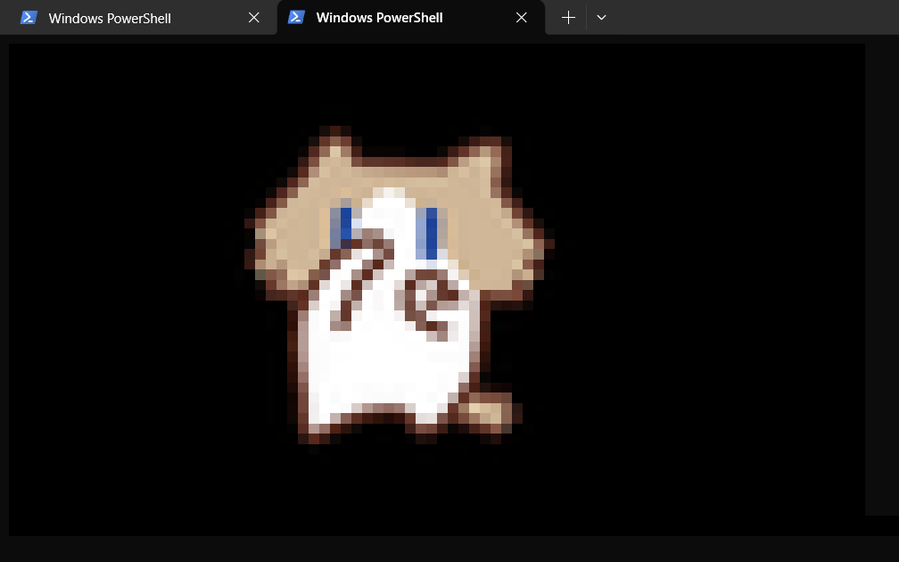

# Termify

> 万物皆可终端 —— 把任何 GIF / 图片转换成终端可播放的动画

[](LICENSE)
[](https://www.python.org/downloads/)

**核心价值**：把"我会做终端动画"这件事的门槛降到零。上传文件 → 点击风格卡片 → 下载可运行文件，**三步出活**，无需注册、无需安装、下载即走。



## 快速体验（30 秒做出第一个动画）

```bash
# 1. 克隆 + 安装依赖（仅第一次）
git clone https://github.com/ZhangJing-gugugaga/Termify.git
cd Termify
pip install -r requirements.txt

# 2. 启动 Web 服务
python app.py
# 浏览器自动打开 http://127.0.0.1:5000
```

在浏览器里：
1. 把 GIF / PNG / JPG 拖到页面上（或点一下选择文件）
2. 点击卡片选择风格，预览区立即播放
3. 点"下载动画文件"，拿到 `.py` 或 `.html` 文件

下载后怎么用？

| 文件类型 | 打开方式 |
|---------|---------|
| `.py` 脚本 | 打开终端，运行 `python 你下载的文件.py`，按 Ctrl+C 停止 |
| `.html` 页面 | 双击即可在浏览器里播放，无需网络、无需安装 |

## 两种用法：Web vs 命令行

| 方式 | 适合谁 | 怎么开始 |
|------|--------|---------|
| **🌐 Web 界面**（推荐） | 所有人、想要实时预览 | `python app.py` → 浏览器访问 `http://127.0.0.1:5000` |
| **🖥 命令行** | 开发者、批量处理、无桌面环境 | `python demo.py 你的图片.gif --charset all` |

**推荐先用 Web 界面** — 它提供实时预览、风格切换、GIF 播放控制，比命令行友好得多。命令行适合跑在服务器上批量处理。

## Web 界面使用指南（详细）

### Step 01 · 上传素材

- 把 GIF / PNG / JPG **直接拖拽**到页面上的虚线区域
- 或者**点击上传区域选择文件**

支持格式：`.gif` / `.png` / `.jpg`，最大 **20MB**。

> 💡 **静态图片（PNG/JPG）也可以上传！** Termify 会把它当作"只有一帧的动画"，输出的播放器会循环显示同一帧 —— 适合做"终端艺术字"。

### Step 02 · 选择渲染风格

点击 5 张风格卡片中的任意一张，预览区立即切换。试试不同风格 — 每次切换都在 100ms 内完成：

| 风格 | 字符 | 适合场景 | 颜色 |
|------|------|---------|------|
| **经典 ASCII** 灰度 | `@#%*+=-:.` | 复古感、极简、任何终端 | ❌ 灰度 |
| **Unicode 色块** | `█▀▄` + TrueColor | 最像原图、视觉冲击力 | ✅ 24-bit |
| **Braille 点阵** | `⠁⠂⠄⡀` | 高分辨率、科技感 | ❌ 灰度 |
| **几何图形** | `■□▪▫●○◆◇` | 设计感、现代 | ❌ 灰度 |
| **极简二值** | `█ ` | 复古报纸印刷感 | ❌ 纯黑白 |

**我的第一张动画选什么？** 不确定就选 **Unicode 色块** —— 它的画质最接近原图，一眼就能看出效果。

### Step 03 · 预览 + 调整

- **Play / Pause 按钮** — 控制播放
- **点击进度条** — 跳转到任意帧
- **帧计数器** — 显示"当前帧 / 总帧数"

右下角有个 **⚙️ 齿轮按钮**（Tweaks 面板），可以开关背景网格、扫描线、主题色，以及自定义前景色/背景色。

### Step 04 · 选择输出格式

右侧面板里选择：

- **Python 脚本（.py）**：在终端播放，零依赖，按 Ctrl+C 停止。
- **HTML 页面（.html）**：浏览器打开即播放，更适合分享、手机查看。
- **嵌入式设备（v2 即将支持）**：Arduino / ESP32 代码。

### Step 05 · 选择终端尺寸

右下角"终端尺寸"区域（40×20 / 80×24 / 120×36 / 160×48 / 200×60）—— 直接在预览区点数字就可以切换。

```
   画质 ←→ 文件大小

   40×20   ████░░░░░░  最轻量、最粗糙
   80×24   ██████░░░░  默认值，预览体验好
   120×36  ████████░░  高清，细节清晰
   160×48  ██████████  超清（自动缩放以适应视口）
   200×60  ██████████  极致（自动缩放，文件较大）
```

> 💡 **选择建议**：不确定就选 **120×36** —— 画质和体积的甜点。选 160×48 或 200×60 时终端会自动缩小显示，**但最终输出的文件仍是全分辨率**。

### Step 06 · 下载

点击 **"下载动画文件"** 按钮，文件就保存到本地了。

## 命令行用法

```bash
# 转换单个图片
python demo.py my_cat.gif --charset ascii

# 生成全部 5 种字符集的输出（共 10 个文件）
python demo.py my_cat.gif --charset all

# 指定终端尺寸
python demo.py my_cat.gif --charset blocks --width 120 --height 36

# 指定输出目录
python demo.py my_cat.gif --charset all --out my_outputs
```

输出文件命名规则：`{图片名}_{字符集}.py` 和 `{图片名}_{字符集}.html`，生成在 `outputs/` 目录（或指定目录）。

## 终端全屏播放

下载的 `.py` 脚本在终端中运行时，会**自动适应终端窗口大小**：
- 动画等比缩放，始终居中显示
- 拖拽终端窗口边缘改变大小时，动画实时跟随重新缩放
- 无论终端是 80×24 还是 200×60，都能自动填满

**音频支持**：将 `music.mp3` 放在 `.py` 文件同目录下，播放器会自动检测并播放（使用系统自带音频工具，无需安装额外依赖）。

> 💡 推荐使用 **Windows Terminal** 或 **macOS Terminal** 以获得最佳 TrueColor 显示效果。Windows 旧版 cmd 也可能正常显示，播放器会自动启用 ANSI 支持。

## 画质优化贴士

- **想慢动作看细节？** 默认 80×24 适合快速预览；要更清晰选 **120×36** 或更大。
- **Unicode 色块（blocks）最像原图** —— 它承载 24 位真彩色，每个单元格展示上下两个像素。
- **Braille 点阵** 每个字符覆盖 2×4 像素，但**视觉面积较小**，强烈建议配合 160×48 或 200×60 大尺寸。
- **高分辨率 = 大文件**。200×60 blocks 单帧约 60KB，100 帧 GIF 输出约 6MB。下载时间略长，但画质最好。
- **终端里看乱码？** 默认绿色来自 ANSI 转义 — 部分 Windows 旧版终端不支持，请改用 HTML 输出格式。
- **分辨率与终端尺寸**：高分辨率（如 200×60）需要更大的终端窗口才能完整显示。如果终端不够大，Python 播放器会自动等比缩放以适应当前窗口——源分辨率越高，缩放后的细节越丰富。你也可以手动放大终端窗口（PowerShell 右上角拖拽边缘，或修改字体大小）来获得最佳效果。

## 常见问题

**Q: 我没有编程经验，能玩吗？**
A: 完全可以。启动 `python app.py` → 浏览器里拖图片 → 点卡片 → 点下载，全程不用写一行代码。

**Q: 下载的 .py 文件怎么跑？**
A:
- **Windows**：打开 PowerShell（Win+R 输入 `powershell`），进入下载目录，运行 `python 文件名.py`。如果提示"python 不存在"，请安装 [Python 3.10+](https://www.python.org/downloads/)。
- **macOS / Linux**：打开 Terminal，进入下载目录，运行 `python3 文件名.py`。

**Q: 为什么终端里显示绿色 / 乱码？**
A: 你的终端可能不支持 TrueColor ANSI。解决方法：
1. 改用 **HTML 输出格式**（推荐），浏览器打开就正常
2. 或换用 **ASCII/Braille/几何图形/二值** 等非彩色风格 —— 它们只输出纯文本

**Q: 手机能打开 .html 文件吗？**
A: 可以。通过微信/AirDrop/数据线传到手机，用浏览器打开；**横屏**观看效果更好。

**Q: 下载的文件多大？**
A: 取决于尺寸和帧数：
- 80×24 ascii 10 帧 → ~2 KB
- 120×36 blocks 24 帧 → ~200 KB
- 200×60 blocks 100 帧 → ~6 MB

**Q: 可以上传视频吗？**
A: 目前只支持 GIF / PNG / JPG。视频先用工具转成 GIF（推荐 [ezgif.com](https://ezgif.com/video-to-gif)）再上传。

**Q: 200×60 超清点不了 / 播放卡怎么办？**
A: 超清输出会自动缩放以适应视口，**下载的文件仍是全分辨率**。播放卡顿可以换浏览器（Chrome 最快）；或选小一号尺寸。

**Q: 支持批量下载吗？**
A: Web 界面一次只能处理一个文件。批量请用命令行 `python demo.py 文件 --charset all`。

**Q: 错误 `ModuleNotFoundError` 或 `python 不是内部命令`？**
A: Python 未安装或未加入 PATH。请安装 Python 3.10+ 并在安装时勾选"Add Python to PATH"。

## API 文档

如果你想用程序调用 Termify（比如集成到其他项目），提供 5 个接口：

| 方法 | 路径 | 说明 |
|------|------|------|
| `GET` | `/` | 主页 |
| `POST` | `/api/upload` | 上传文件（multipart/form-data），返回 `task_id` + 元数据 |
| `GET` | `/api/preview/<task_id>` | 获取帧数据。参数：`charset`（风格）、`width`、`height`、`frame`（某帧）、`fg`/`bg`（颜色，形如 `rgb(255,0,0)`）。不传 `frame` 返回全部帧。 |
| `POST` | `/api/generate` | 打包指定字符集+格式，返回 `download_url` |
| `GET` | `/api/download/<filename>` | 下载生成的文件 |

### 示例

```bash
# 上传文件
curl -X POST http://127.0.0.1:5000/api/upload -F "file=@cat.gif"
# 返回: {"task_id": "abc123", "frames_count": 24, ...}

# 获取第一帧（blocks 风格）
curl "http://127.0.0.1:5000/api/preview/abc123?charset=blocks&frame=0"

# 生成带自定义颜色的 Python 输出
curl -X POST http://127.0.0.1:5000/api/generate \
  -H "Content-Type: application/json" \
  -d '{"task_id":"abc123","charset":"ascii","format":"python","fg":"rgb(255,176,0)"}'

# 下载
curl -O http://127.0.0.1:5000/api/download/abc123_ascii.py
```

## 项目结构

```
Termify/
├── app.py                  # Flask 入口（路由 + 内存任务存储）
├── demo.py                 # CLI 冒烟测试
├── requirements.txt        # flask / pillow / pytest
├── termify/                # 后端转换引擎（纯 Python 库）
│   ├── charset.py          # 5 种字符集 + 像素→字符映射
│   ├── frames.py           # GIF 抽帧 + 等比缩放
│   ├── engine.py           # convert() → FrameSequence
│   ├── ansi_to_html.py     # ANSI → HTML 颜色转换
│   └── output/
│       ├── python.py       # 生成 .py 播放脚本
│       └── html.py         # 生成 .html 播放页
├── templates/index.html    # 前端页面（Jinja2 模板）
├── static/
│   ├── css/{tokens,app}.css
│   └── js/app.js           # 前端逻辑
├── tests/                  # pytest 单元测试（45 tests）
├── ui-mockup.html          # UI 视觉唯一真相源
└── README.md               # 本文件
```

## 技术栈

- **后端**：Python 3.10+、Flask、Pillow
- **前端**：原生 HTML/CSS/JS，无框架依赖
- **测试**：pytest（45 tests，运行 `pytest tests/` 即可）
- **主题**：暗色终端美学，JetBrains Mono + Space Grotesk 字体

## 参与贡献

1. Fork + clone 仓库
2. 新建分支 `git checkout -b feat/your-feature`
3. 改代码 + 跑测试 `pytest tests/ -v`
4. 提交 Pull Request

遇到问题？先查 [FAQ](#常见问题) → 再开 [Issue](https://github.com/ZhangJing-gugugaga/Termify/issues)。

## License

[MIT](LICENSE)
