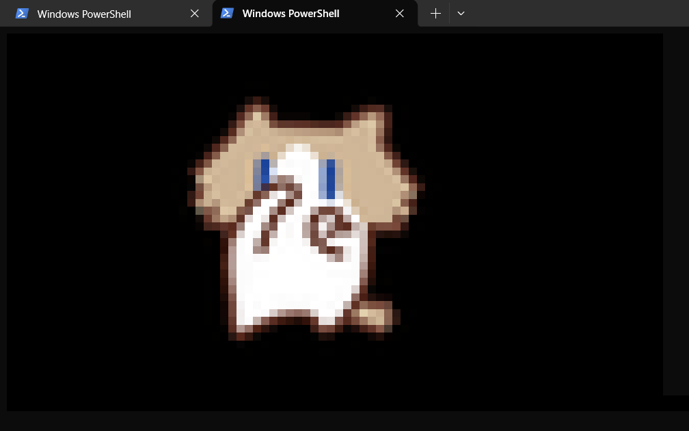

# Termify

> 万物皆可终端 —— 把任何 GIF / 图片转换成终端可播放的动画

[](https://www.python.org/downloads/)

**核心价值**：把"我会做终端动画"这件事的门槛降到零。上传文件 → 点击风格卡片 → 下载可运行文件，**三步出活**，无需注册、无需安装、下载即走。

## 🌐 在线体验（零安装、直接玩）

| 入口 | 链接 | 说明 |
|------|------|------|
| **🔗 在线 Demo** | [https://termify.moonzj.com](https://termify.moonzj.com) | 直接上传 GIF/PNG/JPG，生成终端动画 |
| **🖼️ 作品画廊** | [https://termify.moonzj.com/gallery](https://termify.moonzj.com/gallery) | 浏览社区作品，查看别人的终端创作 |

> 💡 **不懂命令行？直接点上面链接** —— 浏览器拖图进去就能玩，零安装、零配置。\
> 📋 **想批量处理或离线用？** 继续看下面的本地安装指南。



## 快速体验（30 秒做出第一个动画）

```bash
# 1. 克隆 + 安装依赖（仅第一次）
git clone https://github.com/ZhangJing-gugugaga/Termify.git
cd Termify
pip install -r requirements.txt

# 2. 启动 Web 服务
python app.py
# 浏览器自动打开 http://127.0.0.1:5000
```

在浏览器里：
1. 把 GIF / PNG / JPG 拖到页面上（或点一下选择文件）
2. 点击卡片选择风格，预览区立即播放
3. 点"下载动画文件"，拿到 `.py` 或 `.html` 文件

下载后怎么用？

| 文件类型 | 打开方式 |
|---------|---------|
| `.py` 脚本 | 打开终端，运行 `python 你下载的文件.py`，按 Ctrl+C 停止 |
| `.html` 页面 | 双击即可在浏览器里播放，无需网络、无需安装 |

## 两种用法：Web vs 命令行

| 方式 | 适合谁 | 怎么开始 |
|------|--------|---------|
| **🌐 Web 界面**（推荐） | 所有人、想要实时预览 | `python app.py` → 浏览器访问 `http://127.0.0.1:5000` |
| **🖥 命令行** | 开发者、批量处理、无桌面环境 | `python demo.py 你的图片.gif --charset all` |

**推荐先用 Web 界面** — 它提供实时预览、风格切换、GIF 播放控制，比命令行友好得多。命令行适合跑在服务器上批量处理。

## Web 界面使用指南（详细）

### Step 01 · 上传素材

- 把 GIF / PNG / JPG **直接拖拽**到页面上的虚线区域
- 或者**点击上传区域选择文件**

支持格式：`.gif` / `.png` / `.jpg`（图片 ≤ 20MB）；`.mp4` / `.webm` / `.mov` / `.avi` / `.mkv`（视频不限时长，长视频自动降采样，≤ 20MB，`TERMIFY_MAX_VIDEO_MB` 可调）。上传过程有真实进度条和预计剩余时间。

> 💡 **静态图片（PNG/JPG）也可以上传！** Termify 会把它当作"只有一帧的动画"，输出的播放器会循环显示同一帧 —— 适合做"终端艺术字"。

### Step 02 · 选择渲染风格

点击 7 张风格卡片中的任意一张，预览区立即切换。试试不同风格 — 每次切换都在 100ms 内完成：

> ⚡ **全程本地渲染**：上传完成后，7 种风格 × 5 档尺寸的切换全部在你的浏览器内即时完成（零服务器往返）。服务端预览仅作为旧设备自动回退。
> ℹ️ 英文提示：After upload, all 7 styles × 5 terminal sizes switch instantly in your browser — no server round-trip.

| 风格 | 字符 | 适合场景 | 颜色 |
|------|------|---------|------|
| **经典 ASCII** 灰度 | `@#%*+=-:.` | 复古感、极简、任何终端 | ❌ 灰度 |
| **Unicode 色块** | `█▀▄` + TrueColor | 最像原图、视觉冲击力 | ✅ 24-bit |
| **Braille 点阵** | `⠁⠂⠄⡀` | 高分辨率、科技感 | ❌ 灰度 |
| **几何图形** | `■●◆▪▫◇○` + 透明背景 | 设计感、现代，背景完全透明 | ❌ 灰度 |
| **极简二值** | `█ ` | 复古报纸印刷感 | ❌ 纯黑白 |
| **明暗渐变块** | `█▓▒░ ` | 平滑灰度渐变，比标点更有质感 | ❌ 灰度 |
| **自定义字符** | 你说了算 | 在 Tweaks 面板填任意字符序列（密→疏） | ❌ 灰度 |

**我的第一张动画选什么？** 不确定就选 **Unicode 色块** —— 它的画质最接近原图，一眼就能看出效果。

### Step 03 · 预览 + 调整

- **Play / Pause 按钮** — 控制播放
- **点击进度条** — 跳转到任意帧
- **帧计数器** — 显示"当前帧 / 总帧数"

右下角 **⚙️ 齿轮按钮**（Tweaks 面板）可以开关背景网格、扫描线，填**自定义字符集**。

**配色 / Color scheme**（输出面板，与风格卡片同级）：一次选择同时作用于预览窗口与 py / HTML / MP4 导出，所见即所得：

| 配色 | 效果 |
|------|------|
| **黑白** | 白字黑底，复古终端 |
| **磷光绿**（默认） | 经典 CRT 磷光屏 |
| **琥珀橘** | 老式琥珀显示器 |
| **冰蓝** | 冷色调科技感 |
| **原色** | 逐字符取源像素真彩色（TrueColor），任何风格都能保留原图色彩 |
| **自定义** | 自选前景/背景色 |

> 💡 选了**原色**后还会出现「py 用 256 色兼容老终端」选项——默认 24-bit 真彩在 Windows Terminal / iTerm2 等现代终端效果最佳；老终端（如默认 cmd）可勾选 256 色模式，色彩略降但兼容性更好。

### Step 04 · 选择输出格式

右侧面板里选择：

- **Python 脚本（.py）**：在终端播放，零依赖，按 Ctrl+C 停止。
- **HTML 页面（.html）**：浏览器打开即播放，更适合分享、手机查看。
- **MP4 视频（.mp4）**：把字符动画渲染成真视频，微信/朋友圈/QQ 直接播放。导出在服务器同步进行，弹窗会显示预计耗时（限 6 次/分钟，服务器繁忙时会提示稍后再试）。

### Step 05 · 选择终端尺寸

右下角"终端尺寸"区域：**连续滑杆（20–400 列，默认 80 列）**。拖动滑杆时行数按素材宽高比**自动推导**（列数 × 素材高宽比 ÷ 2，字符格 1:2），任何比例的素材都不会留黑边或变形。切换分辨率**只改变渲染精度**，预览窗口的位置和大小保持不变，如同视频播放器切画质。

下面这张图是**滑杆位置对应的画质参考**（不是按钮，档位仅供估算）：

```
   画质 ←→ 文件大小

   40 列   ████░░░░░░  最轻量、最粗糙
   80 列   ██████░░░░  默认值，预览体验好
   120 列  ████████░░  高清，细节清晰
   160 列  ██████████  超清（自动缩放以适应视口）
   200 列  ██████████  极致（自动缩放，文件较大）
   …400 列 极限精度（滑杆拉满，>320 列会提示渲染变慢 / 文件增大）
```

> 💡 **选择建议**：不确定就选 **120 列** —— 画质和体积的甜点。大尺寸时终端会自动缩小显示，**但最终输出的文件仍是全分辨率**。

### Step 06 · 下载

点击 **"下载动画文件"** 按钮，文件就保存到本地了。

> 📦 `.py` 产物的帧数据以 zlib+Base85 压缩内嵌，同等内容体积比早期版本小约 70%（视频动画从 11MB 级降到 1-3MB 级）。运行时自动解压，仍只需 Python 3.6+、零第三方依赖。

## 文字艺术（Text Art）

独立页面 `/text-art`：把**文字**本身变成 ASCII 艺术字，和「图片 → 字符动画」并列。

### 三种创作方式

1. **直转（FIGlet）** —— 输入文字、选字体，即时渲染。精选 24 款字体。注意 FIGlet 只处理 ASCII，**中文等非 ASCII 字符会被忽略**（不是报错）。
2. **字体墙** —— 一次输入，同屏预览全部字体，点击即换即看（限 60 次/分钟）。
3. **AI 创作** —— 用自然语言描述想要的效果，交给 LLM 生成，双模式：

   | 模式 | 行为 | 适合 |
   |------|------|------|
   | `params` | LLM 解析出「文字 + 字体」参数，再交给 FIGlet 渲染 | 结果规整、字体可控 |
   | `direct` | LLM 直接输出字符画 | 更有创意、超出字体库 |

   生成后可继续**迭代**：给出修改意见（如"再粗一点""换个风格"）在当前结果上调整。
   未配置 LLM 时，页面展示 AI 作品示例墙，而不是裸报错。

### 导出矩阵

| 格式 | 说明 |
|------|------|
| PNG | 终端风格图片，直接保存分享 |
| ANSI 彩色 | 带颜色的纯文本，贴到支持 ANSI 的终端/编辑器 |
| HTML | 单文件网页，浏览器打开即看 |
| 终端命令 | 可直接粘贴执行的形式 |

6 种配色主题：`green`（默认）/ `cyan` / `amber` / `magenta` / `red` / `white`。

### LLM 配置（自部署，可选）

不配置也能用——直转和字体墙不依赖 LLM。想用 AI 创作时，配置任意 **OpenAI 兼容端点**（含本地 Ollama）：

```bash
python demo.py llm --base-url http://localhost:11434/v1 --model qwen2.5:7b
python demo.py llm --status          # 查看当前配置
```

配置存在服务端 `data/llm_config.json`，**不会上传、也不会回传给浏览器**。Ollama 等本地端点无需 API Key。

## 命令行用法

```bash
# 转换单个图片
python demo.py my_cat.gif --charset ascii

# 生成全部灰度字符集的输出（6 种 × 2 格式 = 12 个文件）
python demo.py my_cat.gif --charset all

# 指定终端尺寸
python demo.py my_cat.gif --charset blocks --width 120 --height 36

# 指定输出目录
python demo.py my_cat.gif --charset all --out my_outputs

# 打印第一帧预览 / 关闭进度条
python demo.py my_cat.gif --charset blocks --preview --quiet
```

### 子命令：文字艺术与 LLM

```bash
# 文字 → 艺术字（默认 standard 字体，打印到终端）
python demo.py text "hello"

# 指定字体 / 写入文件
python demo.py text "hello" --font ansi_shadow --out out.txt

# 列出全部可用字体
python demo.py text --font list

# LLM 配置（与 Web 端共用）
python demo.py llm --base-url http://localhost:11434/v1 --model qwen2.5:7b
python demo.py llm --status
```

输出文件命名规则：`{图片名}_{字符集}.py` 和 `{图片名}_{字符集}.html`，生成在 `outputs/` 目录（或指定目录）。

## 终端全屏播放

下载的 `.py` 脚本在终端中运行时，会**自动适应终端窗口大小**：
- 动画等比缩放，始终居中显示
- 拖拽终端窗口边缘改变大小时，动画实时跟随重新缩放
- 无论终端是 80×24 还是 200×60，都能自动填满

**音频支持**：将 `music.mp3` 放在 `.py` 文件同目录下，播放器会自动检测并播放（使用系统自带音频工具，无需安装额外依赖）。

> 💡 推荐使用 **Windows Terminal** 或 **macOS Terminal** 以获得最佳 TrueColor 显示效果。Windows 旧版 cmd 也可能正常显示，播放器会自动启用 ANSI 支持。

## 画质优化贴士

- **想慢动作看细节？** 默认 80×24 适合快速预览；要更清晰选 **120×36** 或更大。
- **Unicode 色块（blocks）最像原图** —— 它承载 24 位真彩色，每个单元格展示上下两个像素。
- **Braille 点阵** 每个字符覆盖 2×4 像素，但**视觉面积较小**，强烈建议配合 160×48 或 200×60 大尺寸。
- **高分辨率 = 大文件**。200×60 blocks 单帧约 60KB，100 帧 GIF 输出约 6MB。下载时间略长，但画质最好。
- **终端里看乱码？** 默认绿色来自 ANSI 转义 — 部分 Windows 旧版终端不支持，请改用 HTML 输出格式。
- **分辨率与终端尺寸**：高分辨率（如 200×60）需要更大的终端窗口才能完整显示。如果终端不够大，Python 播放器会自动等比缩放以适应当前窗口——源分辨率越高，缩放后的细节越丰富。你也可以手动放大终端窗口（PowerShell 右上角拖拽边缘，或修改字体大小）来获得最佳效果。

## 常见问题

**Q: 必须装 Python 才能用吗？**
A: 不必须！三种方式都能玩：

| 方式 | 适合 | 要装什么 |
|------|------|---------|
| [在线 Demo](https://termify.moonzj.com) | 只是想试试 | **零安装**，浏览器直接拖图 |
| [桌面 .exe](#桌面客户端一键独立包) | 离线/大文件 | 下载 `Termify.exe`，双击即用 |
| 本地 `python app.py` | 开发者/批量处理 | Python 3.10+ |

> 💡 90% 的人直接点在线 Demo 就够了。

**Q: 我没有编程经验，能玩吗？**
A: 完全可以。点 [termify.moonzj.com](https://termify.moonzj.com) → 浏览器里拖图片进去 → 点风格卡片 → 点下载，三步出活。

**Q: 怎么分享我的终端动画给朋友？**
A: 三种方式：

| 方式 | 朋友看到什么 | 朋友要装什么 |
|------|-------------|-------------|
| **发 .html 文件** | 浏览器打开直接播放动画 | 零 |
| **分享画廊链接** | 点 `/v/<id>` 短链，直接预览 + 下载 | 零 |
| **发 .py 脚本** | 终端播放动画 | Python 3.10+ |

> 💡 推荐用 `.html`：朋友双击就能看，跨平台、零依赖。发微信群/AirDrop/邮件都行。

**Q: 画廊是什么？**
A: [termify.moonzj.com/gallery](https://termify.moonzj.com/gallery) — 上传作品到公共画廊，获得一个短链（如 `/v/aBcDeFgH`），朋友点开就能看到你转的动画。支持点赞、标签筛选。

**Q: 有桌面版吗？**
A: 有。从 [Releases](https://github.com/ZhangJing-gugugaga/Termify/releases) 下载 `Termify.exe`，双击启动后自动打开浏览器访问本地 Web 界面，功能跟在线 Demo 完全一致，适合离线环境或大文件处理。

**Q: 下载的 .py 文件怎么跑？**
A:
- **Windows**：打开 PowerShell（Win+R 输入 `powershell`），进入下载目录，运行 `python 文件名.py`。如果提示"python 不存在"，请安装 [Python 3.10+](https://www.python.org/downloads/)。
- **macOS / Linux**：打开 Terminal，进入下载目录，运行 `python3 文件名.py`。

**Q: 为什么终端里显示绿色 / 乱码 / 方框？**
A: 这通常有两个原因：

1. **终端不支持 TrueColor ANSI**（影响 blocks 风格）：
   - 改用 **HTML 输出格式**（推荐），浏览器打开就正常
   - 或换用 **ASCII/几何图形/二值** 等非彩色风格

2. **终端字体不支持 Unicode 字符**（影响 geometric/braille 风格）：
   - 使用 **Windows Terminal**（已内置 Unicode 支持）
   - 安装 Nerd Font 字体（如 [JetBrainsMono Nerd Font](https://www.nerdfonts.com/)），然后在终端设置中选用
   - 改用 **HTML 输出格式**，浏览器对 Unicode 支持最好

> 💡 **推荐配置**：Windows Terminal + JetBrainsMono Nerd Font 字体，可完美显示所有风格。

**Q: 手机能打开 .html 文件吗？**
A: 可以。通过微信/AirDrop/数据线传到手机，用浏览器打开；**横屏**观看效果更好。也可以直接发画廊链接，手机浏览器点开即看。

**Q: 我上传的文件去哪了？安全吗？**
A: 上传的文件仅用于临时转换，任务完成后自动清理（默认 1 小时）。不会存储你的源文件，不会用于任何其他用途。在线 Demo 使用 HTTPS 加密传输。

**Q: 下载的文件多大？**
A: 取决于尺寸和帧数：
- 80×24 ascii 10 帧 → ~2 KB
- 120×36 blocks 24 帧 → ~200 KB
- 200×60 blocks 100 帧 → ~6 MB

**Q: 可以上传视频吗？**
A: 支持 📹！上传 MP4 / WEBM / MOV / AVI / MKV（不限时长，长视频自动降采样；≤ 20MB，限 4 次/分钟），后端 ffmpeg 自动抽帧转换成动画。也支持拖入 `.gif` / `.png` / `.jpg`。还可以直接贴 **Bilibili / 抖音 / YouTube** 视频链接，服务器自动解析。

**Q: 大尺寸（200 列以上）点不了 / 播放卡怎么办？**
A: 超清输出会自动缩放以适应视口，**下载的文件仍是全分辨率**。播放卡顿可以换浏览器（Chrome 最快）；或把滑杆往回拖一号。

**Q: 支持批量上传吗？**
A: 支持。Web 界面现在可以一次拖拽或多个选择多个文件（或 Ctrl/Cmd + 点击多选），每个文件独立处理。命令行批量仍可用 `python demo.py 文件 --charset all`。

**Q: 错误 `ModuleNotFoundError` 或 `python 不是内部命令`？**
A: Python 未安装或未加入 PATH。请安装 Python 3.10+ 并在安装时勾选"Add Python to PATH"。或者直接用 [在线 Demo](https://termify.moonzj.com)，零安装。

## API 文档

如果你想用程序调用 Termify（比如集成到其他项目），常用接口如下（另有画廊/音乐等接口见源码；所有接口均有限流）：

| 方法 | 路径 | 说明 |
|------|------|------|
| `GET` | `/` | 主页 |
| `POST` | `/api/upload` | 上传单个文件（multipart/form-data），返回 `task_id` + 元数据 |
| `POST` | `/api/upload-batch` | 批量上传多个文件（multipart，字段名 `files[]`），返回 `task_ids[]` + `errors[]` |
| `POST` | `/api/fetch-url` | 从 URL 下载图片并转换（`{"url":"..."}`），含 SSRF 防护 |
| `POST` | `/api/upload-video` | 上传视频（MP4/WEBM/MOV/AVI/MKV），后端 ffmpeg 抽帧后转换；不限时长（自适应采样）、≤20MB、限 4 次/分钟 |
| `POST` | `/api/fetch-video-url` | 从 Bilibili / 抖音 / YouTube 链接解析视频并转换（域名白名单 SSRF 防护），限 2 次/分钟 |
| `GET` | `/api/preview/<task_id>` | 获取帧数据。参数：`charset`（风格，含 `shades`/`custom`）、`width`、`height`（均 1–400）、`frame`（某帧）、`fg`/`bg`（颜色，形如 `rgb(255,0,0)`）、`chars`（custom 必填，自定义字符梯，密→疏）、`color`（配色模式：`mono` 缺省 / `source` 逐字符源像素真彩 / `source256` 量化 xterm-256 兼容老终端）。不传 `frame` 返回全部帧。 |
| `POST` | `/api/generate` | 打包指定字符集+格式（`python`/`html`/`mp4`），返回 `download_url`。可选 `color`（同 preview，产物文件名带 `_src`/`_src256` 段）、`fg`/`bg`（单色）。`mp4` 为同步编码（限 6 次/分钟，2 路并发），需服务器安装 ffmpeg |
| `GET` | `/api/download/<filename>` | 下载生成的文件 |
| `GET` | `/api/task-frames/<task_id>` | 拉取任务的源帧（base64 JPEG，≤400×240），供前端本地渲染；限 30 次/分钟，帧数 >600 或载荷 >40MB 返回 413 |
| `POST` | `/api/upload-music` | 为任务附加背景音乐（mp3/wav/m4a/aac/ogg/flac ≤20MB），导出时优先于视频原声 |
| `GET` | `/api/audio-info/<task_id>` | 查询任务是否已挂载音频 |

### 文字艺术接口

| 方法 | 路径 | 说明 |
|------|------|------|
| `GET` | `/api/text/fonts` | 精选字体列表（24 款），返回 `fonts:[{name, slug}]` |
| `POST` | `/api/text/convert` | 文字 → 艺术字。入参 `text`、`font`（字体 slug）、`width`；返回 `art`/`rows`/`cols`。限 120 次/分钟 |
| `POST` | `/api/text/fontwall` | 字体墙：一次输入 → 全部字体预览。入参 `text`。限 60 次/分钟 |
| `POST` | `/api/text/ai` | AI 创作。入参 `prompt`（≤500 字）、`mode`（`params` \| `direct`）。限 6 次/分钟 |
| `POST` | `/api/text/iterate` | 在已有结果上迭代。入参 `current_art`、`instruction`。限 6 次/分钟 |
| `POST` | `/api/text/export-png` | 导出 PNG。入参 `art`、`theme`（6 主题，缺省 `green`）、`fg`、`name` |
| `POST` | `/api/text/export-ansi` | 导出 ANSI 彩色文本。入参 `art`、`theme` |
| `POST` | `/api/text/export-html` | 导出单文件 HTML。入参 `art`、`theme`、`name` |
| `GET`/`POST` | `/api/llm/config` | 读取/写入 LLM 配置（`base_url`、`model`、`api_key`）。GET 只回传 `has_key`，**不回传密钥明文**。限 10 次/分钟 |

> 主题取值：`green`（默认）/ `cyan` / `amber` / `magenta` / `red` / `white`。
> 另有画廊接口（`/api/gallery/*`：发布、列表、点赞、举报、自定义标签、管理台）见源码，此处不展开。

### 示例

```bash
# 上传文件
curl -X POST http://127.0.0.1:5000/api/upload -F "file=@cat.gif"
# 返回: {"task_id": "abc123", "frames_count": 24, ...}

# 获取第一帧（blocks 风格）
curl "http://127.0.0.1:5000/api/preview/abc123?charset=blocks&frame=0"

# 生成带自定义颜色的 Python 输出
curl -X POST http://127.0.0.1:5000/api/generate \
  -H "Content-Type: application/json" \
  -d '{"task_id":"abc123","charset":"ascii","format":"python","fg":"rgb(255,176,0)"}'

# 下载
curl -O http://127.0.0.1:5000/api/download/abc123_ascii.py

# 批量上传（多文件）
curl -X POST http://127.0.0.1:5000/api/upload-batch \
  -F "files=@cat.gif" -F "files=@dog.png"

# URL 直输
curl -X POST http://127.0.0.1:5000/api/fetch-url \
  -H "Content-Type: application/json" \
  -d '{"url":"https://example.com/image.gif"}'

# 视频上传（后端 ffmpeg 抽帧）
curl -X POST http://127.0.0.1:5000/api/upload-video -F "file=@clip.mp4"

# 文字艺术：列出字体 → 转换
curl http://127.0.0.1:5000/api/text/fonts
curl -X POST http://127.0.0.1:5000/api/text/convert \
  -H "Content-Type: application/json" \
  -d '{"text":"Termify","font":"ansi_shadow"}'
```

## 桌面客户端（一键独立包）

不想装 Python？下载打包好的独立 `.exe` 文件，**双击即用**。启动后会自动打开浏览器，访问本地 Web 界面（跟在线 Demo 功能完全一致）。

> 📦 源码仓库根目录含 `termify.spec` + `termify_launcher.py` + `deploy.sh`，可在任意平台自行构建。

### Windows 用户

从 [GitHub Releases](https://github.com/ZhangJing-gugugaga/Termify/releases) 下载最新的 `Termify-<version>.zip`，解压后：

```
Termify/
├── Termify.exe    # 双击启动！
├── _internal/     # 运行时依赖（不要动这个文件夹）
└── ...
```

> ⚠️ 首次双击时 Windows 可能弹出"已保护你的电脑"。这是正常现象（自签名未认证），点击"更多信息"→"仍要运行"即可。

### macOS / Ubuntu / Fedora 用户

```bash
# 1. 从源码构建桌面包
git clone https://github.com/ZhangJing-gugugaga/Termify.git
cd Termify
pip install pyinstaller

# 2. 一键构建
pyinstaller termify.spec --clean --noconfirm

# 3. 启动
dist/Termify/Termify   # 双击或在终端中打开
```

> 🍎 macOS 用户如果遇到"无法验证开发者"，打开终端运行 `./dist/Termify/Termify` 即可。

### 桌面包 vs 在线 Demo 对比

| 场景 | 选哪个 |
|------|--------|
| 只是想试一下 | **在线 Demo**（零安装） |
| 离线环境 / 懒得连网 | **桌面包**（本地运行） |
| 源图太大（>20MB） | **桌面包**（可以绕过在线 20MB 上限） |
| 想要最新功能 | **在线 Demo**（自动随 main 分支更新） |

> 💡 桌面包启动后跟在线 Demo 完全一致 —— 上传、选风格、预览、下载 `.py/.html`，**所有产物都在你机器上**。


## 项目结构

```
Termify/
├── app.py                  # Flask 入口（路由 + 限流 + 安全头）
├── demo.py                 # CLI：图片转换 / text 文字艺术 / llm 配置
├── requirements.txt        # flask / pillow / pyfiglet / pytest / beautifulsoup4 / yt-dlp
├── termify/                # 后端转换引擎（纯 Python 库）
│   ├── charset.py          # 7 种字符集（含 shades/custom）+ 像素→字符映射
│   ├── frames.py           # GIF 抽帧 + 等比缩放
│   ├── engine.py           # convert() → FrameSequence
│   ├── ansi_to_html.py     # ANSI → HTML 颜色转换
│   ├── taskstore.py        # SQLite 任务存储（多 worker 共享）
│   ├── paths.py            # 产物路径基准（仓库根锚定，TERMIFY_BASE_DIR 可覆盖）
│   ├── gallery.py          # 画廊功能（SQLite 元数据 + 缩略图生成）
│   ├── textart.py          # 文字艺术：FIGlet 直转 + LLM 双模式 + 导出矩阵
│   ├── llm.py              # LLM 配置读写（OpenAI 兼容端点，key 不回传浏览器）
│   ├── video.py            # 视频接入（ffmpeg 抽帧，自适应采样）
│   ├── videofetch.py       # 视频链接解析（yt-dlp + 域名白名单）
│   ├── urlfetch.py         # URL 直输（SSRF 防护下载）
│   └── output/
│       ├── python.py       # 生成 .py 播放脚本
│       ├── html.py         # 生成 .html 播放页
│       └── video.py        # 生成 .mp4（ffmpeg 同步编码）
├── templates/              # Jinja2 页面模板
│   ├── index.html          # 主工作台（图片/视频 → 字符动画）
│   ├── text_art.html       # 文字艺术页
│   ├── gallery.html        # 画廊列表
│   ├── view_work.html      # 作品分享页
│   ├── admin.html          # 管理台
│   └── _gallery_modal.html # 发布到画廊弹窗（片段）
├── static/
│   ├── css/{tokens,app,text_art}.css
│   ├── js/app.js           # 主工作台逻辑
│   ├── js/text_art.js      # 文字艺术页逻辑
│   └── js/termify-render.js # 浏览器本地渲染器（7 风格镜像实现）
├── tests/                  # pytest 单元测试（396 tests + JS 渲染一致性脚本）
├── Caddyfile               # 生产反向代理（自动 HTTPS + 安全头）
├── termify.service         # systemd 单元文件
├── deploy.sh               # ECS 一键部署
└── README.md               # 本文件
```

## 技术栈

- **后端**：Python 3.10+、Flask、Pillow、pyfiglet（文字艺术）
- **前端**：原生 HTML/CSS/JS，无框架依赖
- **测试**：pytest（396 tests，运行 `pytest -q` 即可）
- **主题**：暗色终端美学，JetBrains Mono + Space Grotesk 字体

## 🐛 反馈与 ISSUE

使用过程中遇到任何问题，欢迎提 [GitHub Issue](https://github.com/ZhangJing-gugugaga/Termify/issues/new/choose)。

### Issue 提交流程

| 步骤 | 说明 |
|------|------|
| 1. **搜索已有 Issue** | 确认没人报过同样的问题 → 避免重复 |
| 2. **选择模板** | Bug Report / Feature Request / 问题求助，选最匹配的 |
| 3. **填够信息** | 见下方模板 |

### 🐞 Bug Report 模板

```markdown
### 版本信息
- Termify 来源: 在线 Demo / 桌面包 / 本地 git clone
- 操作系统: Windows 11 / macOS 14 / Ubuntu 22.04
- 浏览器: Chrome 126 / Firefox 128 / Safari 17
- Python 版本（如适用）: 3.13.2

### 重现步骤
1. 打开 https://termify.moonzj.com（或桌面包）
2. 上传 [具体文件，最好附截图或链接]
3. 选择 [风格名 + 尺寸]
4. 点 [具体按钮]
5. 看到 [期望 vs 实际]

### 期望行为
清晰的一句话。

### 实际行为
附上截图、报错原文（不要截取部分）、浏览器控制台输出（F12 → Console）。
```

### 💡 Feature Request 模板

```markdown
### 场景描述
我遇到的问题是……（一句话说清真实场景）

### 期望方案
我希望 Termify 提供 [具体功能] —— 它应该 [做什么]、[对用户有什么好处]

### 替代方案
A. 我先用 [workaround] 工作，但不够好
B. 也可以 [备选方案]，但代价是……
```

> 💡 **小技巧**：附带一张截图或 5 秒 GIF 演示你遇到的问题，维护者能更快理解。

### 社区讨论与问答

- **Discussions**：看 Issue 列表旁边有个 [Discussions](https://github.com/ZhangJing-gugugaga/Termify/discussions) 标签，适合"怎么用 / 做了什么 / 我有个想法但还没想清楚"类问题
- **提交前 Checklist**：
  - [ ] 已经读过 [FAQ](#常见问题) + [画质优化贴士](#画质优化贴士)
  - [ ] 已搜索过已有 [Issue](https://github.com/ZhangJing-gugugaga/Termify/issues?q=is%3Aissue)
  - [ ] 已注明 Termify 来源（在线 / 桌面 / 本地）

## 参与贡献

欢迎 Pull Request！无论你是修一个 typo 还是加一个新字符集。

### 开发流程

```bash
# 1. Fork + clone 仓库
git clone https://github.com/<你的用户名>/Termify.git
cd Termify

# 2. 新建分支（分支名为 type/scope，如 fix/typo 或 feat/new-charset）
git checkout -b feat/your-feature

# 3. 改代码 + 跑全量测试
pip install -r requirements.txt
pytest -q                    # 基线 396 tests，必须全绿
```

### 代码规范

| 约定 | 说明 |
|------|------|
| **分支命名** | `type/scope`，如 `feat/new-charset` / `fix/memory-leak` / `docs/readme` / `test/regression` |
| **Commit 消息** | [Conventional Commits](https://www.conventionalcommits.org/) 中文，如 `feat(charset): 新增 emoji 字符集` |
| **PR 标题** | 同 commit 格式，注明关闭哪个 Issue（如 `Closes #42`） |
| **测试** | 新功能必须在 `tests/` 里补对应的 pytest（`git add -f` 因为 .gitignore 会吞 `test_*.py`） |
| **不破主分支** | main 受保护，只在 feature/fix 分支开发，PR 合并后不直接推 main |

### 当前技术栈

- Python 3.10+, Flask, Pillow
- 前端原生 HTML/CSS/JS，无框架依赖（Jinja2 模板）
- pytests（**217** tests，跑 `pytest -q`）
- PyInstaller 做桌面包

### 我能贡献什么？

| 技能 | 能做什么 |
|------|---------|
| Python | 新增字符集、优化转换速度、修 bug |
| 前端 | 优化 Web UI、加动画效果、改善无障碍 |
| 设计 | UI/UX 改版、Logo 重塑、网站样式 |
| 文档 | 翻译 README、写教程、修拼写错 |
| 测试 | 补端到端测试、性能回退测试 |
| 运维 | 改进部署脚本、加 CI/CD、Docker 化 |

> 💬 **不确定从哪开始？** 找标签 `good first issue` 的 Issue，或到 [Discussions](https://github.com/ZhangJing-gugugaga/Termify/discussions) 开一个帖子问。

遇到问题？先查 [FAQ](#常见问题) → 再开 [Issue](https://github.com/ZhangJing-gugugaga/Termify/issues/new/choose)。
